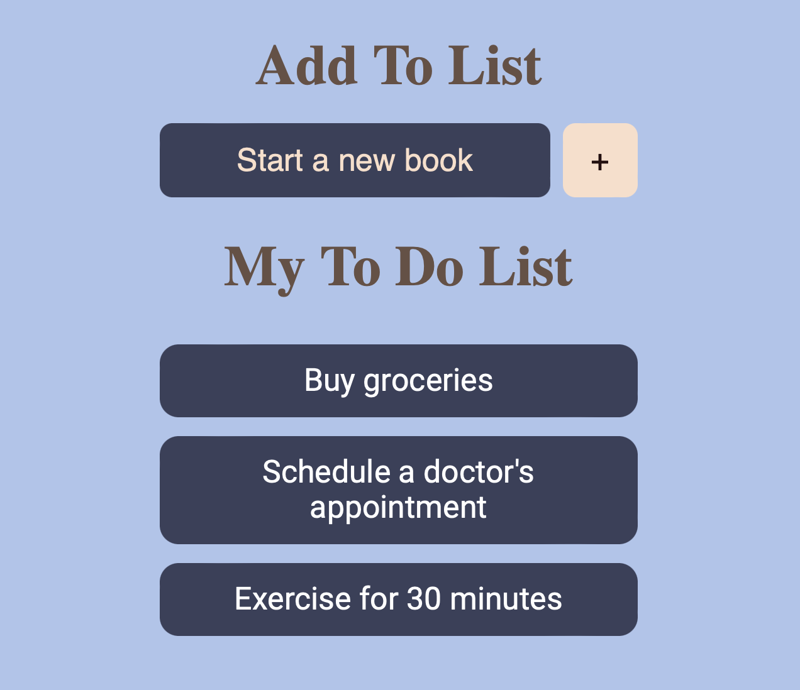

## My Scrimba Practice
## Javascript Firebase Realtime Todo List


This is a simple web application that allows you to create and manage a todo list using JavaScript and Firebase Realtime Database. The application provides real-time synchronization of tasks across multiple devices, enabling seamless collaboration and updates.

Features

Create new tasks: Add tasks to the todo list with a title and optional description.
Real-time synchronization: Changes made by one user are immediately reflected on other devices using Firebase Realtime Database.
Responsive design: The application is designed to work seamlessly on both desktop and mobile devices.

Learn HTML and CSS  
Learn JaveScript  
Learn React   
Learn UI Design Fundamentals  
Learn Typescript    
Learn FLexbox    
Learn CSS Grid  
Build and Deploy Portfolio  
Build a Mobile App with Firebase   
Learn ES6+   
Learn React Router 6   

Quick start:

```
$ npm install
$ npm start
````

Head over to https://vitejs.dev/ to learn more about using vite
## About Scrimba

At Scrimba our goal is to create the best possible coding school at the cost of a gym membership! 💜
If we succeed with this, it will give anyone who wants to become a software developer a realistic shot at succeeding, regardless of where they live and the size of their wallets 🎉
The Frontend Developer Career Path aims to teach you everything you need to become a Junior Developer, or you could take a deep-dive with one of our advanced courses 🚀

- [Our courses](https://scrimba.com/allcourses)
- [The Frontend Career Path](https://scrimba.com/learn/frontend)
- [Become a Scrimba Pro member](https://scrimba.com/pricing)

Happy Coding!
